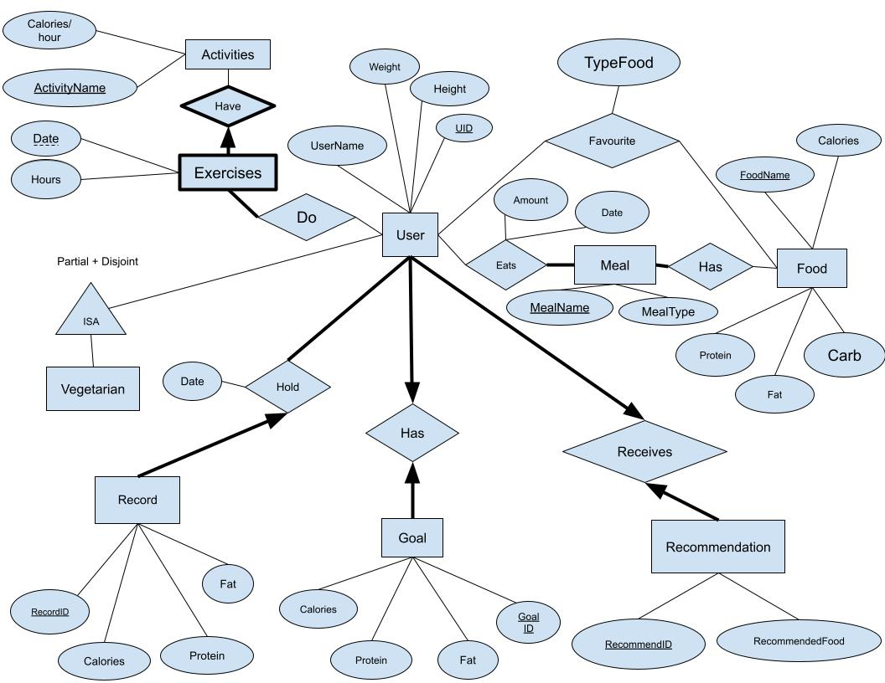

# Nutritrack 365 - UBC CPSC 304 Intro to Relational Database Project

## A full stack web application that keep track of daily food intake and built with React, Node.js, Express.js, and MySQL

This is our project for UBC CPSC 304 to practice using SQL. This project helps individuals maintain a balanced diet by tracking their daily food intake, and exercise/ activities level. It also provides recommendations to help them reach their goals.

- Create a responsive user-friendly front-end with React
- Create a back-end server using Node.js and API endpoints using Express.js
- Using MySQL as our database system, which is hosted on Aiven.io

## ER Diagarm

## Instruction

1. Clone this project
2. run "npm run dev" in the "frontend" directory
3. run "npm run dev" in the "backend" directory simultaneously
4. go to [localhost:5137](http://localhost:5173/)
5. Enjoy the website
